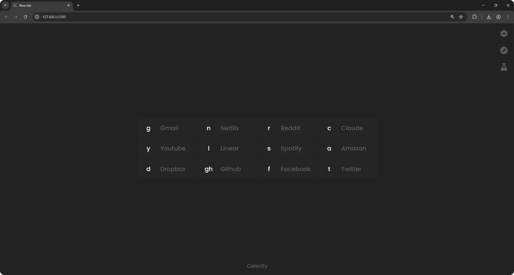

<!-- PROJECT LOGO -->

## About

Celerity is a keyboard-first new tab experience designed for utility instead of aesthetics. It is intentionally restrained prioritizing your clarity over visual noise or feature overload.

## Features

- **Keyboard-first navigation**  
  Launch websites with short commands.

- **Direct site search**  
  Query platforms without having to open them first.

- **Default search fallback**  
  Unknown inputs resolve into a search automatically.

- **Create custom shortcuts**  
  Tailor commands to match personal workflows.

 

## Philosophy

Celerity is built around 3 core ideas:
  
- Clean, well-crafted functional design is the foundation of anything genuinely pleasing.
- The interface should become invisible to the user once learned.
- A keyboard should serve as a command surface, not just text entry.

Celerity is **NOT** meant to replace the browser or become a dashboard.  
It acts as a lightweight layer that helps you access information quicker, and branch off to separate workflows more swiftly.

 
 

<a href="#readme-top">Back to top</a>

