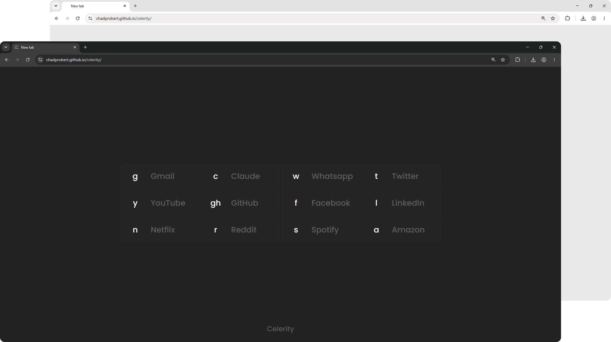

# Celerity

Celerity replaces your new tab page with a keyboard-driven command launcher. It is designed for utility instead of visual aesthetics. This enables you to launch sites and search the web without friction or distraction.
   

## Features

- **Keyboard-first navigation**  
  Launch websites with short commands.

- **Direct site search**  
  Query platforms without having to open them first.

- **Create custom shortcuts**  
  Tailor commands to match personal workflows.

 

## Philosophy

Celerity is built around 3 core ideas:
  
- Clean, well-crafted functional design is the foundation of anything genuinely pleasing.
- The interface should become invisible to the user once learned.
- A keyboard should serve as a command surface, not just text entry.
 
## Contributors

 

<a href="#readme-top">Back to top</a>

