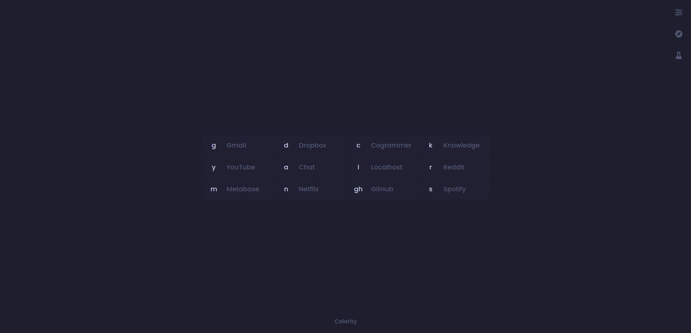

<a name="readme-top"></a>

<!-- PROJECT LOGO -->
<div align="center">

<!-- -->

# Celerity
Press, enter — done

  <p>
    <a href="https://chadprobert.github.io/celerity/">Demo</a>
    »
    <a href="https://github.com/ChadProbert/celerity/issues">Report Bug</a>
    »
    <a href="https://github.com/ChadProbert/celerity/pulls">Request Feature</a>
  </p>

  <!-- SHIELDS.IO -->


<br/>

</div>

<br/>
<br/>

<!-- TABLE OF CONTENTS -->
<details>
  <summary>Table of Contents</summary>
  <ol>
    <li><a href="#about-the-app">About The App</a></li>
    <li><a href="#getting-started">Getting Started</a></li>
    <li><a href="#usage">Usage</a></li>
    <li><a href="#customization">Customization</a></li>
    <li><a href="#contributors">Contributors</a></li>
  </ol>
</details>

<br/>

## About The App

Celerity is a productivity-focused custom new tab page that transforms browser navigation with powerful keyboard shortcuts.

It allows you to:

- **Rapidly access sites** with simple key commands (press a key, hit enter, done)
- **Direct search from any site** by typing a key followed by your query
- **Customize shortcuts** to match your workflow needs
- **Switch between themes** including dark mode, light mode, and developer-inspired colour schemes
- **Configure settings** including tab behaviour and search engine preferences

It is designed for keyboard-centric users who value efficiency and minimalism. Celerity eliminates the need for bookmarks and reduces repetitive navigation to frequently visited sites.

<br/>

## Getting Started

### Installation

<!-- Add links once published to the Chrome Web Store:

Chrome Web Store:
```
[Link to Celerity on Chrome Web Store]
```

Firefox Add-ons:
```
[Link to Celerity on Firefox Add-ons]
``` -->

For development:

```sh
git clone https://github.com/ChadProbert/celerity.git
```

<br/>

## Usage

To visit a site, type its keyboard shortcut and press enter:

- `g` ➜ Gmail
- `r` ➜ Reddit
- `y` ➜ YouTube

### Site Search

Type a space after a site's shortcut to search directly on that site:

- `y JavaScript tutorial` ➜ Search YouTube for "JavaScript tutorial" videos
- `a Why is JavaScript so popular?` ➜ Prompt ChatGPT with a question
- `s Lofi coding` ➜ Search Spotify for "Lofi coding" songs, playlists and podcasts

### Path Navigation

Navigate to specific paths:

- `r/r/webdev` ➜ Navigates to Reddit's /r/webdev subreddit
- `y/feed/subscriptions` ➜ Navigates to your YouTube subscription feed

### Default Search

If your input doesn't match any shortcut, Celerity performs a Google search:

- `hello world javascript` ➜ Searches Google for "hello world javascript"

<br />

## Customization

### Shortcut Management

Add, edit, or remove shortcuts.


### Theme Selection

Choose from several built-in themes including Dark, Light, One Dark Pro, Catppuccin and GitHub themes.

<div align="center">
  <table>
    <tr>
      <td align="center">
        <strong>Dark Abyss</strong><br/>
        
      </td>
      <td align="center">
        <strong>Light Theme</strong><br/>
        
      </td>
    </tr>
    <tr>
      <td align="center">
        <strong>One Dark Pro</strong><br/>
        
      </td>
      <td align="center">
        <strong>Catppuccin (Frappe)</strong><br/>
        
      </td>
    </tr>
    <tr>
      <td align="center">
        <strong>Catppuccin (Macchiato)</strong><br/>
        
      </td>
      <td align="center">
        <strong>Catppuccin (Mocha)</strong><br/>
        
      </td>
    </tr>
     <tr>
      <td align="center">
        <strong>GitHub Dark</strong><br/>
        
      </td>
      <td align="center">
        <strong>GitHub High Contrast</strong><br/>
        
      </td>
    </tr>
  </table>
</div>

<br/>

## Contributors

[](https://github.com/ChadProbert/)
<br />
<br />
<br />

<p align="center"><a href="#readme-top">(back to top)</a></p>
