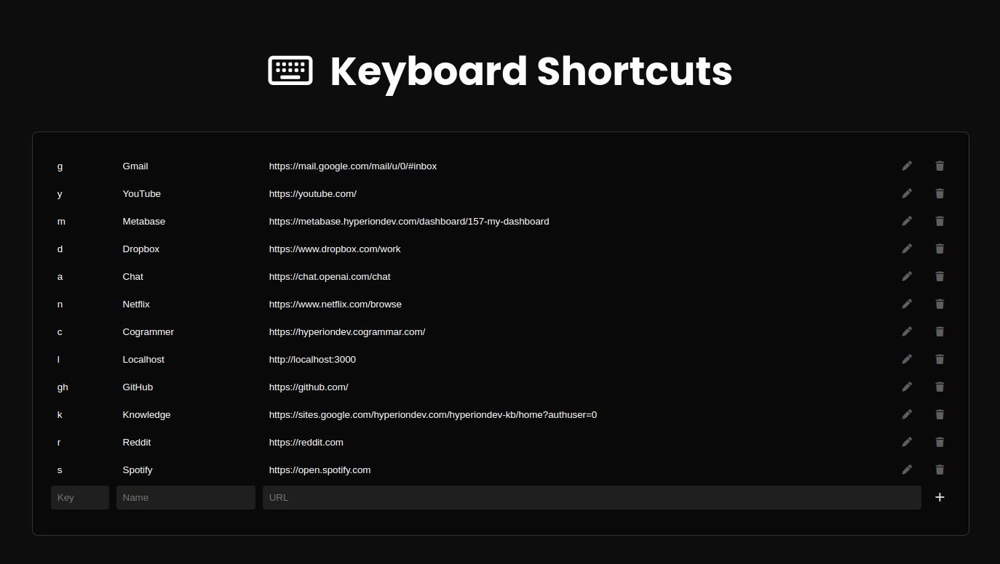

<a name="readme-top"></a>

<!-- PROJECT LOGO -->
<div align="center">

<!-- -->

# Celerity
Press. Enter. Done

  <p>
    <a href="https://chadprobert.github.io/celerity/">Demo</a>
    »
    <a href="https://github.com/ChadProbert/celerity/issues">Report Bug</a>
    »
    <a href="https://github.com/ChadProbert/celerity/pulls">Request Feature</a>
  </p>

  <!-- SHIELDS.IO -->


<br/>

</div>

<br/>
<br/>

<!-- TABLE OF CONTENTS -->
<details>
  <summary>Table of Contents</summary>
  <ol>
    <li><a href="#about-celerity">About Celerity</a></li>
    <li><a href="#philosophy">Philosophy</a></li>
    <li><a href="#features">Features</a></li>
    <li><a href="#getting-started">Getting Started</a></li>
    <li><a href="#usage">Usage</a></li>
    <li><a href="#customization">Customization</a></li>
    <li><a href="#contributors">Contributors</a></li>
  </ol>
</details>

<br/>

## About Celerity

Celerity is a keyboard-first new tab experience designed to reduce friction between intent and action.

It provides a fast, minimal surface for navigating the web using short commands instead of menus, bookmarks, and repeated clicks.

The goal is simple:  
move from *thinking about where to go* → *being there* with as little interruption as possible.

Celerity is intentionally restrained. It prioritizes clarity, speed, and consistency over visual noise or feature overload.

<br/>

## Philosophy

Celerity is built around a few core ideas:

- Navigation should feel immediate, not procedural  
- Speed should be calm and controlled, not chaotic  
- The interface should stay out of the user's way once learned 
- Keyboard input should act as a command surface, not just text entry  

It is **not** meant to replace the browser or become a dashboard.  
It acts as a lightweight layer that helps you move across sites, searches, and workflows more swiftly.

<br/>

## Features

- **Keyboard-first navigation**  
  Launch sites and workflows with short commands.

- **Direct site search**  
  Query platforms without opening them first.

- **Path-based navigation**  
  Jump directly to known destinations.

- **Default search fallback**  
  Unknown inputs resolve into a search automatically.

- **Custom shortcuts**  
  Tailor commands to match personal workflows.

- **Local configuration**  
  Control tab behaviour and search engine selection.

<br/>

## Getting Started

### Installation

<!-- Add links once published to the Chrome Web Store:

Chrome Web Store:
```
[Link to Celerity on Chrome Web Store]
```

Firefox Add-ons:
```
[Link to Celerity on Firefox Add-ons]
``` -->

For development:

```sh
git clone https://github.com/ChadProbert/celerity.git
```

<br/>

## Usage

Celerity interprets short inputs as commands.

### Site Launching

Type a shortcut and press enter:

- **`g`** → Gmail  
- **`r`** → Reddit  
- **`y`** → YouTube  

### Site Search

Add a space and a query to search directly:

- **`y JavaScript tutorial`** → YouTube search  
- **`s Lofi coding`** → Spotify search  

### Path Navigation

### Path Navigation

Navigate directly to known routes:

- **`r/r/webdev`** → Reddit /r/webdev  
- **`y/feed/subscriptions`** → YouTube subscriptions  

### Default Search

If no shortcut matches, input is treated as a search:

- **`hello world javascript`** → Google search  

<br/>

## Customization

### Shortcut Management

Add, edit, and remove shortcuts to match your workflow.



<br/>

## Contributors

[](https://github.com/ChadProbert/)

<br />

<p align="center"><a href="#readme-top">[back to top]</a></p>
